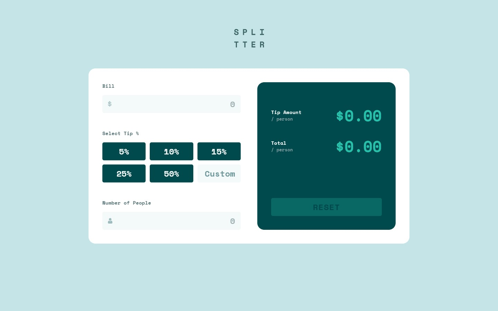

# Frontend Mentor - Tip calculator app solution

This is a solution to the [Tip calculator app challenge on Frontend Mentor](https://www.frontendmentor.io/challenges/tip-calculator-app-ugJNGbJUX). Frontend Mentor challenges help you improve your coding skills by building realistic projects.

## Table of contents

- [Overview](#overview)
  - [The challenge](#the-challenge)
  - [Screenshot](#screenshot)
  - [Links](#links)
- [My process](#my-process)
  - [Built with](#built-with)
  - [What I learned](#what-i-learned)
- [Author](#author)

## Overview

### The challenge

Users should be able to:

- View the optimal layout for the app depending on their device's screen size
- See hover states for all interactive elements on the page
- Calculate the correct tip and total cost of the bill per person

### Screenshot



### Links

- Solution URL: [Add solution URL here](https://your-solution-url.com)
- Live Site URL: [https://lucasngtg.github.io/tip-calculator-app/](https://lucasngtg.github.io/tip-calculator-app/)

## My process

### Built with

- Semantic HTML5 markup
- CSS custom properties
- Flexbox
- CSS Grid
- Mobile-first workflow

### What I learned

I'm proud of the live price input formatting. Here is the code snippet:

``` 
const parts = value.toString().split(".");
const decimals = parts[1].toString().split("");

parts[0] += decimals[0];

if (/^0/.test(parts[0])) {
    parts[0] = parts[0].slice(1);
}

decimals.shift();
parts[1] = decimals.join("");

return parts.join(".");
```

## Author

- Frontend Mentor - [@LucasNgTg](https://www.frontendmentor.io/profile/LucasNgTg)
- GitHub - [@LucasNgTg](https://https://github.com/LucasNgTg)
